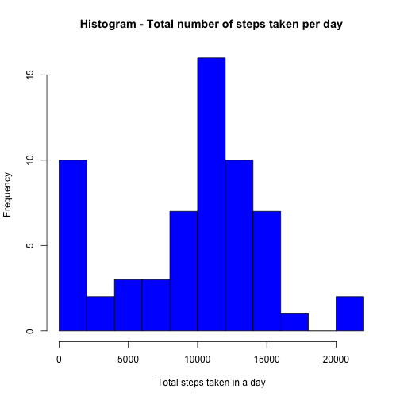
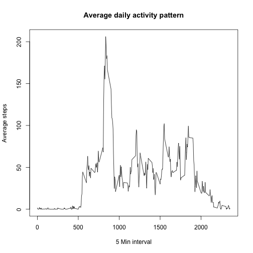
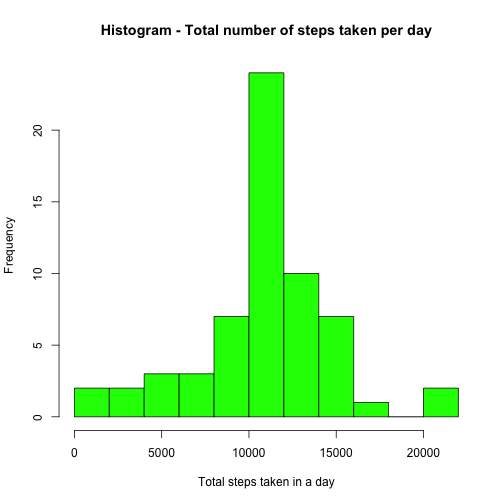
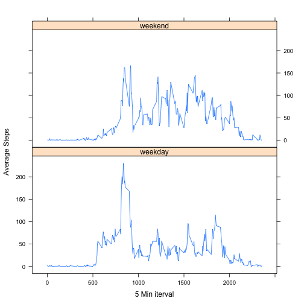

Author: B


## Loading and preprocessing the data


```r
activityAll<-read.csv(file = "activity.csv")
```

## What is mean total number of steps taken per day?
For this part of the assignment, you can ignore the missing values in the dataset.
Calculate the total number of steps taken per day.
Make a histogram of the total number of steps taken each day


```r
activityDaily<-aggregate(steps ~date,data=activityAll,sum,na.rm=TRUE,na.action=na.pass)
names(activityDaily) <- c("Date", "TotalSteps")
head(activityDaily)
```

```
##         Date TotalSteps
## 1 2012-10-01          0
## 2 2012-10-02        126
## 3 2012-10-03      11352
## 4 2012-10-04      12116
## 5 2012-10-05      13294
## 6 2012-10-06      15420
```

```r
hist(activityDaily$TotalSteps,freq=T,breaks=10, col="blue", main="Histogram - Total number of steps taken per day", xlab="Total steps taken in a day")  
```

 

**Mean Calculations**

Calculate and report the mean and median of the total number of steps taken per day


```r
totalStepsMean<-round(mean(activityDaily$TotalSteps),4)
totalStepsMedian<-median(activityDaily$TotalSteps)
```

Mean of the total number of steps taken per day:**9354.2295**

Median of the total number of steps taken per day:**10395**

## What is the average daily activity pattern?
Make a time series plot (i.e. type = "l") of the 5-minute interval (x-axis) and the average number of steps taken, averaged across all days (y-axis)

```r
activityStepsMean <- aggregate(steps ~ interval, data = activityAll, FUN=mean, na.rm=TRUE,na.action=na.pass)
names(activityStepsMean) <- c("Interval", "MeanSteps")
head(activityStepsMean)
```

```
##   Interval MeanSteps
## 1        0 1.7169811
## 2        5 0.3396226
## 3       10 0.1320755
## 4       15 0.1509434
## 5       20 0.0754717
## 6       25 2.0943396
```

```r
summary(activityStepsMean)
```

```
##     Interval        MeanSteps      
##  Min.   :   0.0   Min.   :  0.000  
##  1st Qu.: 588.8   1st Qu.:  2.486  
##  Median :1177.5   Median : 34.113  
##  Mean   :1177.5   Mean   : 37.383  
##  3rd Qu.:1766.2   3rd Qu.: 52.835  
##  Max.   :2355.0   Max.   :206.170
```

```r
plot(activityStepsMean, type = "l", main="Average daily activity pattern",xlab="5 Min interval", ylab="Average steps")
```

 

Which 5-minute interval, on average across all the days in the dataset, contains the maximum number of steps?

```r
maxMeanStepsIndex<-which.max(activityStepsMean$MeanSteps)
maxInterval<-activityStepsMean$Interval[maxMeanStepsIndex]
```
The five minute interval which contains maximum number of steps is **835** and the value of average max steps is **206.1698113**

## Imputing missing values
Note that there are a number of days/intervals where there are missing values (coded as NA). 
The presence of missing days may introduce bias into some calculations or summaries of the data.
Calculate and report the total number of missing values in the dataset (i.e. the total number of rows with NAs)

```r
missingStepsCount<-sum(is.na(activityAll$steps))
```
The total number of missing values :**2304**

Devise a strategy for filling in all of the missing values in the dataset. 
The strategy I am using is to use the mean for that 5-minute interval. First find out index of all NA steps and then loop through those indexes. While looping through the indexes, replace steps value at index location with the MeanSteps of interval at index location.

Create a new dataset that is equal to the original dataset but with the missing data filled in.

```r
activityAllEx<-activityAll
for (i in which(is.na(activityAllEx$steps))){
  activityAllEx$steps[i]<-activityStepsMean$MeanSteps[activityStepsMean$Interval==activityAllEx$interval[i]]
}

head(activityAllEx)
```

```
##       steps       date interval
## 1 1.7169811 2012-10-01        0
## 2 0.3396226 2012-10-01        5
## 3 0.1320755 2012-10-01       10
## 4 0.1509434 2012-10-01       15
## 5 0.0754717 2012-10-01       20
## 6 2.0943396 2012-10-01       25
```

Make a histogram of the total number of steps taken each day 

```r
activityDailyEx<-aggregate(steps ~date,data=activityAllEx,sum,na.rm=TRUE,na.action=na.pass)
head(activityDailyEx)
```

```
##         date    steps
## 1 2012-10-01 10766.19
## 2 2012-10-02   126.00
## 3 2012-10-03 11352.00
## 4 2012-10-04 12116.00
## 5 2012-10-05 13294.00
## 6 2012-10-06 15420.00
```

```r
hist(activityDailyEx$steps,breaks=10, col="green", main="Histogram - Total number of steps taken per day", 
     xlab="Total steps taken in a day")  
```

 

**Mean Calculations**

Calculate and report the mean and median total number of steps taken per day. Do these values differ from the estimates from the first part of the assignment? 


```r
totalStepsMeanEx<-mean(activityDailyEx$steps)
totalStepsMeanEx
```

```
## [1] 10766.19
```

```r
totalStepsMedianEx<-median(activityDailyEx$steps)
totalStepsMedianEx
```

```
## [1] 10766.19
```

Mean of the total number of steps taken per day:**1.0766189 &times; 10<sup>4</sup>**

Median of the total number of steps taken per day:**1.0766189 &times; 10<sup>4</sup>**

**What is the impact of imputing missing data on the estimates of the total daily number of steps?**

The mean and median values are changed. A change is reflected in histogram as well. Earlier there were lot more days/frequencies falling in 0-2000 steps but that changed with data having imputed values.

## Are there differences in activity patterns between weekdays and weekends?
For this part the weekdays() function may be of some help here. Use the dataset with the filled-in missing values for this part.

Create a new factor variable in the dataset with two levels- **"weekday"** and **"weekend"** indicating whether a given date is a weekday or weekend day.

```r
activityAllEx$date<-as.Date(activityAllEx$date,"%Y-%m-%d")
activityAllEx$dow<-strftime(activityAllEx$date,'%A')
activityAllEx$dowlevel<-factor(as.numeric(strftime(activityAllEx$date,'%u')>5),labels=c("weekday","weekend"))
head(activityAllEx)
```

```
##       steps       date interval    dow dowlevel
## 1 1.7169811 2012-10-01        0 Monday  weekday
## 2 0.3396226 2012-10-01        5 Monday  weekday
## 3 0.1320755 2012-10-01       10 Monday  weekday
## 4 0.1509434 2012-10-01       15 Monday  weekday
## 5 0.0754717 2012-10-01       20 Monday  weekday
## 6 2.0943396 2012-10-01       25 Monday  weekday
```
Make a panel plot containing a time series plot (i.e. type = "l") of the 5-minute interval (x-axis) and the average number of steps taken, averaged across all weekday days or weekend days (y-axis). See the README file in the GitHub repository to see an example of what this plot should look like using simulated data.

```r
activityStepsMeanDOW <- aggregate(steps ~ interval + dowlevel, data=activityAllEx, FUN=mean)
head(activityStepsMeanDOW)
```

```
##   interval dowlevel      steps
## 1        0  weekday 2.25115304
## 2        5  weekday 0.44528302
## 3       10  weekday 0.17316562
## 4       15  weekday 0.19790356
## 5       20  weekday 0.09895178
## 6       25  weekday 1.59035639
```

```r
library(lattice)
xyplot(steps ~ interval | dowlevel, activityStepsMeanDOW, type = "l",layout = c(1, 2),xlab="5 Min iterval",ylab="Average Steps")
```

 
